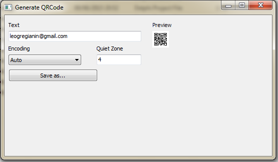

# qrcode-pascal

## Sobre

  * Gerar o código QR Code em Object Pascal
  
  * Este exemplo utiliza a biblioteca desenvolvida pela empresa Debenu Pty Ltd (http://www.debenu.com/open-source) que portou para Delphi o QRCode do projeto ZXing (http://zxing.org/w/decode.jspx). 

## Screenshot

